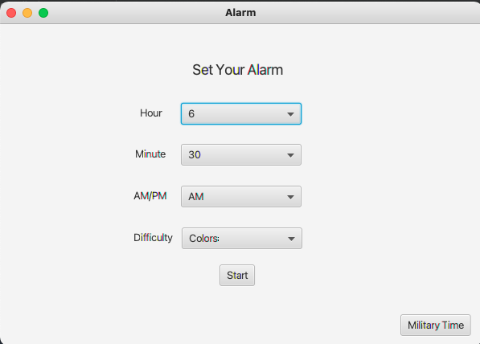

# Puzzle Alarm Clock

## Synopsis
The user sets an alarm for a specific time to be woken up. When the alarm goes off it will play indefinetely until the user completes a simple puzzle.
An option to skip the puzzle will be presented if the user struggles too much with solving it.

## How to Run
To run the alarm sucessfully, the user should run the file ```Alarm.java```


##Code Example
This code generates random colors for each tile in a puzzle and saves the red ones to reference later
```@FXML
	protected void onStart() {
		for(int i = 0; i < blocks.size(); i++) {
			int color = random.nextInt(5);
			if(colors[color].equals("red; ")) {
				redCount++;
				Pane red = blocks.get(i);
				redBlocks.add(red);
			}
			String style = "-fx-background-color: " + colors[color] + "-fx-border-color: black;";
			blocks.get(i).setStyle(style);
			start.setDisable(true);
		}
	}```
